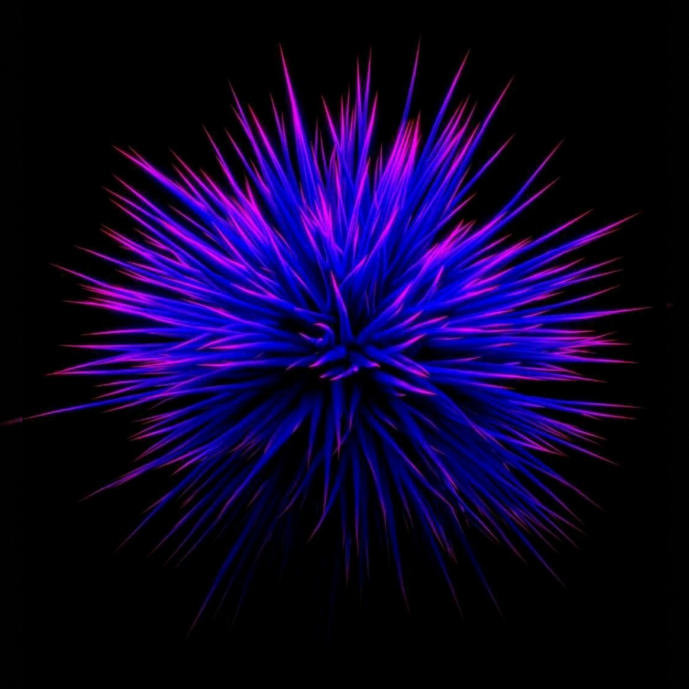
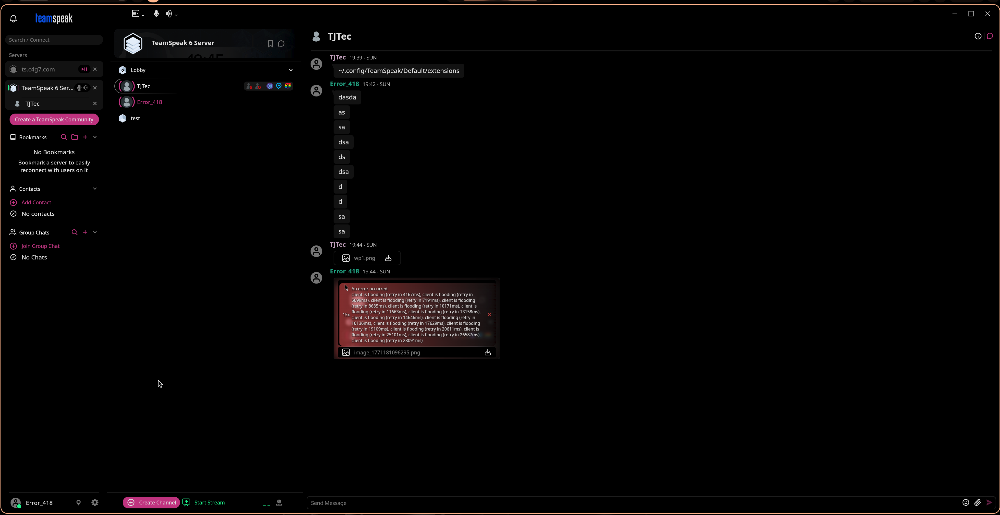
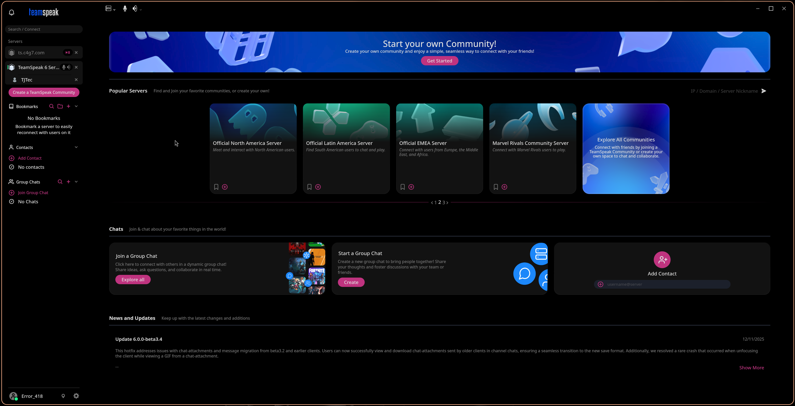
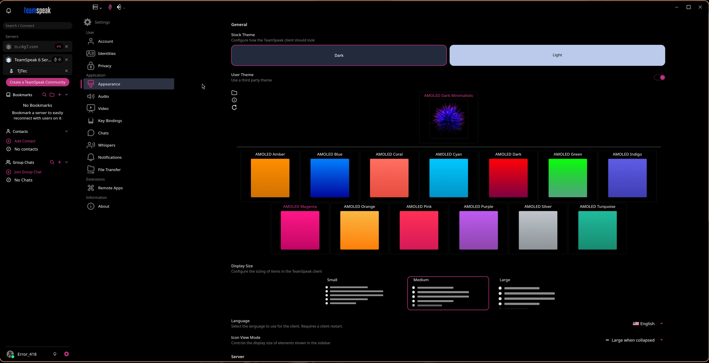

<p align="center">
  
</p>

<h1 align="center">AMOLED Dark Minimalistic</h1>

<p align="center">
  <b>A pure-black AMOLED theme for TeamSpeak</b><br/>
  <sub>Zero distractions. True blacks. Vivid accents.</sub>
</p>

<p align="center">
  
  
  
  
</p>

---

## Screenshots

<p align="center">
  
</p>
<p align="center"><i>Chat — Deep black surfaces with crisp accent highlights</i></p>

<br/>

<p align="center">
  
</p>
<p align="center"><i>Home — Clean discovery page, cards with subtle borders</i></p>

<br/>

<p align="center">
  
</p>
<p align="center"><i>Settings — All 13 accent colors at a glance</i></p>

---

## Features

- **True AMOLED black** — `#000000` base, perfect for OLED displays
- **13 accent colors** — pick the vibe that fits you
- **Flat & minimal** — no blur, no gradients, no glassmorphism
- **Subtle surface hierarchy** — barely-there elevation through near-black shades
- **Thin scrollbars** — 4 px, stays out of the way
- **Clean chat bubbles** — uniform styling for self and remote messages
- **Full coverage** — sidebar, headers, cards, context menus, modals, tooltips, and more

---

## Color Variants

| Theme | Accent | Theme | Accent |
|:---:|:---:|:---:|:---:|
| 🟠 **Amber** | `#c07820` | 🔵 **Blue** | `#2060c0` |
| 🔴 **Coral** | `#c04040` | 🩵 **Cyan** | `#20a0b0` |
| ⚫ **Dark** | `#ffffff` | 🟢 **Green** | `#20a040` |
| 🟣 **Indigo** | `#5040c0` | 🩷 **Magenta** | `#c02080` |
| 🟧 **Orange** | `#c06020` | 💗 **Pink** | `#c04080` |
| 💜 **Purple** | `#8030a0` | 🩶 **Silver** | `#808080` |
| 🩱 **Turquoise** | `#20a080` | | |

---

## Installation

### Quick Install
1. Download the [latest release](https://github.com/c4g7-dev/amoled-dark-minimalistic/releases) or clone this repo
2. Copy the folder to your TeamSpeak extensions directory:
   ```
   ~/.config/TeamSpeak/Default/extensions/
   ```
3. Open TeamSpeak → **Settings** → **Appearance** → enable **User Theme**
4. Select any **AMOLED** variant

### Manual / Git
```bash
cd ~/.config/TeamSpeak/Default/extensions/
git clone https://github.com/c4g7-dev/amoled-dark-minimalistic.git
```
Restart TeamSpeak and activate the theme in Settings → Appearance.

---

## File Structure

```
amoled.dark.minimalistic/
├── package.json          # Theme manifest
├── TeamSpeak.css         # Core base theme (shared by all variants)
├── Glassmorphism.css     # Surface overrides (flat, no blur)
├── Reaper.css            # AMOLED Dark (white accent)
├── Blue.css              # AMOLED Blue
├── Pink.css              # AMOLED Pink
├── Purple.css            # AMOLED Purple
├── Orange.css            # AMOLED Orange
├── Green.css             # AMOLED Green
├── Cyan.css              # AMOLED Cyan
├── Indigo.css            # AMOLED Indigo
├── Magenta.css           # AMOLED Magenta
├── Amber.css             # AMOLED Amber
├── Turquoise.css         # AMOLED Turquoise
├── Silver.css            # AMOLED Silver
├── Coral.css             # AMOLED Coral
└── *.png                 # Variant preview thumbnails
```

---

## Contributing

Pull requests and issues are welcome. To add a new color variant:

1. Create `YourColor.css` — import `TeamSpeak.css` and `Glassmorphism.css`, then override the accent variables
2. Add a matching `YourColor.png` thumbnail (solid gradient, 200×200)
3. Register the theme in `package.json` under `content.themes`

---

## License

[MIT](LICENSE) — do whatever you want with it.

---

<p align="center">
  <sub>Made with 🖤 by <a href="https://github.com/c4g7-dev">Valhalla</a></sub>
</p>
